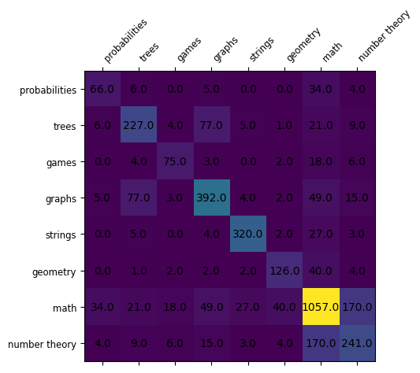
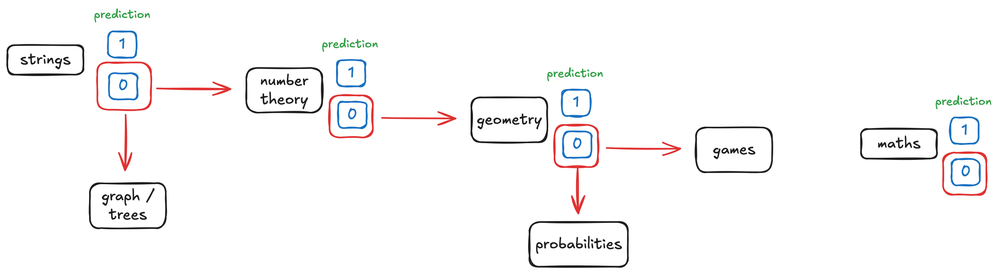

# illuin_code_force

This repository contains my work on the xCodeEval dataset, a task consisting in predicting the tags attached to an programming problem. 

## Problem description

The furnished dataset is composed of 4982 samples of coding exercices with numerous labels. Given the tim and the complexity of predictions, I followed the recommendations and only considered the following tags ['math', 'graphs', 'strings', 'number theory', 'trees', 'geometry', 'games', 'probabilities']. This yields a dataset, after removal duplications, to a dataset composed of 2678 samples with inequal repartition between the labels. 
To make the prediction, we have at our disposal the problem description and the source code. We will only focus on the problem description in this approach. 

### Training and prediction strategy

More precisely the following matrix describes all couples of labels:



Each value corresponds to the number of coding problems tagged as the line and column tags (and the diagonal terms to the number of problems tagged with a specific tag).

We can definitely see that some tags are almost never predicted together like 'strings' and 'games' for instance. This let me think a successive prediction approach with a well chosen order of prediction could work well.

Chosing the prediction order by looking at the number of coding problems belonging to multiple class and the number of samples per class, I propose the following prediction approach:



Each tag is predicted with a different model and downstream models are only trained and evaluated on a portion of the full training dataset.

### Features
In this work, I decided think incrementally in complexity and include (or think if I didn't have enough time) more complex models only if needed.
As of now, I didn't have time to go beyond td-idf features optimization and extraction, but including meaning-based features seems to be needed from the first results I obtained (especially for the tags 'number theory', )

### First results

On a hold-out testing set (never seen by any training model), the tag prediction pipeline obtained the following scores:

| Tag      | Precision | Recall | f1 score | 
| -------- | --------- | ------ | -------- |
| math | 0.75 | 0.86 | 0.80 |
| graphs | 0.67 | 0.61 | 0.64 |
| strings | 0.90 | 0.77 | 0.83 |
| number theory | 0.96 | 0.21 | 0.35 |
| trees | 0.58 | 0.75 | 0.65 |
| geometry | 0.92 | 0.52 | 0.67 |
| games | 1.00 | 0.74 | 0.85 |
| probabilities | 0.92 | 0.73 | 0.81 |

- Proportion of problems entirely predicted correctly: 0.50
- Proportion of problems with at least one tag correctly predicted: 0.81
- Proportion of problems with at least one tag incorrectly predicted: 0.35


### Possible Extensions
- add data augmentation / training penalties techniques in case of poor class representations like for instance the tag "probability"
- using feature selection techniques (mutual information selection, PCA dimension reduction) to improve the choice of the td-idf number of features
- use better tf-idf vocabulary choice as '$' characters are for instance not included in tf-idf for math related tags
- use all predictions to predict the tag math (could help prediction but may not be needed if )
- use comprehensive features for complex tags to predict, specifically for "number theory" tag which prediction model has a poor recall. For instance, MathBERT and SciBERT representations could help predicting the 'math', 'number theory', 'geometry', 'probabilities', 'trees' and 'graphs' tags.
- include a code embedder and fine-tune its representation on the dataset. Using directly td-idf on the solution code doesn't seem to a good idea as the name of the used variables is always clear. A model that understands the logic behind the code is required, such as CodeBERT, which requires more computationnal time. Plus feature selection or dimension reduction techniques are needed as codeBERT output vector (768) is too big for the number of samples in the training dataset.

## Commands
```python
usage: main.py [-h] [--preprocess_data dataset_path save_path] [--train dataset_path] [--eval dataset_path] [--predict dataset_path]

ML Model Prediction and Evaluation for tags attached to programming problems

options:
  -h, --help            show this help message and exit
  --preprocess_data dataset_path save_path
                        Preprocess samples in dataset_path and create working csv with extracted code description and tags. Default value fixed to data/raw_data/
  --train dataset_path  Train the tag all prediction models with default parameters on a preprocessed dataset
  --eval dataset_path   Eval tag prediction models on a specific preprocessed dataset
  --predict dataset_path
                        Predict all tags on a specific preprocessed dataset
```

```python
# preparing data from json to csv
python main.py --preprocess_data data/raw_data/  data/codeforce_dataset.csv

# training the models on the preprocessed csv (includes evaluation on a testing dataset)
python main.py --train data/codeforce_dataset.csv

# evaluate a specific preprocessed dataset (models already fit and stored in src/trained_models)
python main.py --eval data/codeforce_dataset.csv

# run predictions on a specific preprocessed dataset (models already fit and stored in src/trained_models)
python main.py --predict data/codeforce_dataset.csv
```

Note that training may not work without enough data furnished (at least at few examples per tag) due to tf-idf minimum requirements for computing features.
